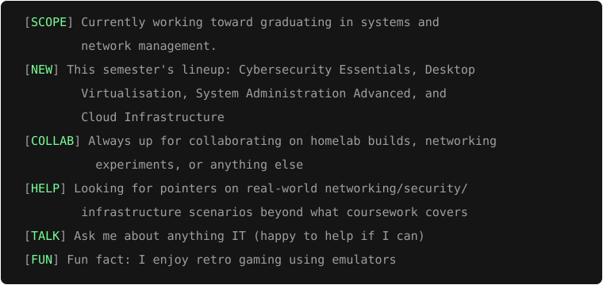

<h1> WHOAMI? </h1>

<table cellspacing="0" cellpadding="0" border="0"> 
<tr>
<td valign="top">
  
```
  ░██████     ░███      ░██████   ░████████   ░██████████ ░███    ░██ ░███    ░██   ░██████   
 ░██   ░██   ░██░██    ░██   ░██  ░██    ░██  ░██         ░████   ░██ ░████   ░██  ░██   ░██  
░██         ░██  ░██  ░██         ░██    ░██  ░██         ░██░██  ░██ ░██░██  ░██ ░██     ░██ 
░██        ░█████████  ░████████  ░████████   ░█████████  ░██ ░██ ░██ ░██ ░██ ░██ ░██     ░██ 
░██        ░██    ░██         ░██ ░██     ░██ ░██         ░██  ░██░██ ░██  ░██░██ ░██     ░██ 
 ░██   ░██ ░██    ░██  ░██   ░██  ░██     ░██ ░██         ░██   ░████ ░██   ░████  ░██   ░██  
  ░██████  ░██    ░██   ░██████   ░█████████  ░██████████ ░██    ░███ ░██    ░███   ░██████
```
---



</td>
</tr>

<table cellspacing="0" cellpadding="0" border="0">
<tr>

<td valign="middle">

</td>

<td valign="middle" align="center" width="295">

</td>

</tr>
</table>
